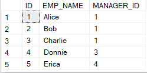
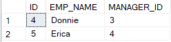
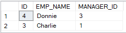
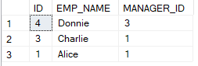

# CTE recursion
!!! warning
    CTE recursion is not real recursion, it is just iteration.

With [Common Table Expressions (CTE)](https://docs.microsoft.com/en-us/sql/t-sql/queries/with-common-table-expression-transact-sql) 
you can create recursions. An often used example is to traverse an organisational hierarchy. Let's say
you have a table containing employees and who their manager is. Then if you provide a starting point it
can traverse the hierarchy tree by joining the `MANAGER_ID` with an `EMPLOYEE_ID`.

Explaining how to understand this recursion functionally is much easier than explaining how the 
recursion actually technically happens. So first we will discuss it functionally and then technically.

But first, let's define a table to work with. To keep it simple we will use a slightly modified version
of the organisational hierarchy examples. In many examples the `MANAGER_ID` of the person at the very
top is `NULL` as he/she does not have a manager. However, we will make it a bit more difficult by 
making that person the manager of itself.

```t-sql linenums="1"
CREATE TABLE #Hierarchy
(
	ID INT
,	EMP_NAME VARCHAR(20)
,	MANAGER_ID INT
)

INSERT INTO #Hierarchy
(ID, EMP_NAME, MANAGER_ID)
VALUES
(1,		'Alice'	,	1),
(2,		'Bob'	,	1),
(3,		'Charlie',  1),
(4,		'Donnie',	3),
(5,		'Erica',	4)
```



## Functional explanation
The CTE format for recursion consists of 2 parts:

1. The anchor query
2. The query used to fetch the next rows

The anchor query is your starting point, it determines in our example at which employee to start
the recursion with. The other query will join your base table with the previous results from the
CTE.

```t-sql linenums="1"
WITH CTE_recursion AS
(
    SELECT *
    FROM BASE_TABLE
    WHERE <filter for your starting point>
    
    UNION ALL
    
    SELECT B.*
    FROM BASE_TABLE AS B
        JOIN CTE_recursion AS R
        ON B.<some_column> = R.<Some_column>
)
SELECT *
FROM CTE_recursion
```

In the second part of the CTE the `BASE_TABLE` is the table providing the new rows and the join
to the `CTE_recursion` (itself) represents the rows of the previous step. So in the organisational 
hierarchy example, if you want to know who the manager is, the CTE contains the employee info and
the `BASE_TABLE` will provide the information for the manager. In the next loop this manager is then 
considered as the employee and the corresponding manager will be looked up. This goes on until the
second part of the CTE does not give any rows. 

!!! warning
    If there is a circular reference, the loop will go on until it reaches the maximum recursions.
    The default is 100. If you think you need more or less tries, you can put the following option
    at the end of your query `OPTION (MAXRECURSION 2)`, in this case it only goes 2 layers deep.

### Example going down the tree
Let's revisit our own example. 


Say we are `Donnie` and we want to know who he is the manager of, and who that person is the manager of 
etc. Since Donnie is only manager of Erica, we expect 2 records since the anchor row will always be there.
The SQL query for that is shown below.

``` t-sql linenums="1" hl_lines="12"
WITH CTE_Recursive AS
(
	SELECT *
	FROM #Hierarchy
	WHERE ID = 4

	UNION ALL

	SELECT H.*
	FROM #Hierarchy AS H
		JOIN CTE_Recursive AS R
			ON H.MANAGER_ID = R.ID
)
SELECT *
FROM CTE_Recursive
```

We start by defining the anchor to have `ID = 4`. Then in the second part we join the `MANAGER_ID`
of the base table with the `ID` of the CTE (the previous record). So what it says is give me the 
person whose manager was in the previous loop.



### Example going up the tree
In this example we are still Donnie. Now we want to know who his manager is, and their manager etc.
We do exactly the same as the previous example, but now we need to revert the join condition.

``` t-sql linenums="1" hl_lines="12 13"
WITH CTE_Recursive AS
(
	SELECT H.*
	FROM #Hierarchy H
	WHERE ID = 4

	UNION ALL

	SELECT H.*
	FROM #Hierarchy AS H
		JOIN CTE_Recursive AS R
			ON H.ID = R.MANAGER_ID
			AND H.ID <> H.MANAGER_ID
)
SELECT *
FROM CTE_Recursive
```

Now the `MANAGER_ID` is taken from the CTE (the previous loop). However, if we look more closely, we 
that there is an infinite loop. Alice is manager of herself. To break out of this loop we need to 
say that for the new record we want to add the `MANAGER_ID` can not be the same as the `ID`. We get 
the following result.



As you can see there is no Alice in the results. This is because the record of Alice does not
satisfy the join condition and thus will not be added. What we need is another condition that loosens
up the previous condition. We will allow the `MANAGER_ID` to be the same as the `ID` as long as it
just occurs once. 

```t-sql linenums="1" hl_lines="13"
WITH CTE_Recursive AS
(
	SELECT H.*
	FROM #Hierarchy H
	WHERE ID = 4

	UNION ALL

	SELECT H.*
	FROM #Hierarchy AS H
		JOIN CTE_Recursive AS R
			ON H.ID = R.MANAGER_ID
			AND (H.ID <> H.MANAGER_ID OR R.ID <> H.ID)

)
SELECT *
FROM CTE_Recursive
```

Here we have added the condition that we can let the record pass when the `ID` of the employee is 
different than the `ID` of the employee in the previous recursive loop. Now Alice shows up once 
correctly.



## Technical explanation
!!! warning
    CTE recursion is not real recursion, it is just iteration.

From the [Postgres docs](https://www.postgresql.org/docs/9.1/queries-with.html): 
!!! quote
    Note: Strictly speaking, this process is iteration not recursion, 
    but `RECURSIVE` is the terminology chosen by the SQL standards committee.

From the archives of [Microsoft docs](https://docs.microsoft.com/en-us/archive/blogs/craigfr/recursive-ctes)
it can also be concluded that only the results of the previous run are available.

!!! quote
    Once it finishes executing the anchor part of the plan, 
    the query processor continues by executing the second input to the concatenation operator 
    which happens to be the recursive part of the plan.  This part of the plan has a nested 
    loops join with the secondary spool as its outer input.  The nested loops join requests a 
    row from the spool which so far contains only the one row for employee 109.  
    The spool returns this row and deletes it from the worktable.  The join then executes the 
    index seek on its inner input to find all employees who work for employee 109.  
    This index seek returns the following rows which the primary spool inserts into the worktable:

Also [this post](https://dba.stackexchange.com/questions/226946/how-does-sql-recursion-actually-work)
on stackexchange concludes that it is not real recursion.