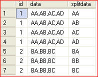

# String split
In SQL server versions 2016 and later, there exist the function [STRING_SPLIT](https://docs.microsoft.com/en-us/sql/t-sql/functions/string-split-transact-sql)
to split the contents of a column based on a delimiter. Each split element will become a new row.

```t-sql
SELECT value FROM STRING_SPLIT('Lorem ipsum dolor sit amet.', ' ');
```
Has the following table as output:

| value    |
|----------|
| Lorem    |
| ipsum    |
| dolor    |
| sit      |
| amet.    |

## The workaround
The trick is by wrapping the contents in XML tags and turn each element into an XML node.

1. Prepend the string to be split with an opening tag `<X>`
2. Replace the delimeter with a closing tag followed directly with an opening tag `</X><X>`
3. At the end of the string put the last closing tag `</X>`

So if you have a string that looks like 
```
A,B,C,D,E
```
then after the modifications you will have
``` XML
<X>A</X><X>B</X><X>C</X><X>D</X><X>E</X>
```

After these preparations are done, you can use SQL XML functions combined with a `CROSS APPLY` to
give each node a separate row.

An example from mssqltips: https://www.mssqltips.com/sqlservertip/1771/splitting-delimited-strings-using-xml-in-sql-server/

``` t-sql linenums="1"
DECLARE @t TABLE( ID INT IDENTITY, data VARCHAR(50))
INSERT INTO @t(data) SELECT 'AA,AB,AC,AD'
INSERT INTO @t(data) SELECT 'BA,BB,BC'

SELECT 
    F1.id,
    F1.data,
    O.splitdata 
FROM
(
    SELECT 
        *
    ,   CAST('<X>'+replace(F.data,',','</X><X>')+'</X>' as XML) as xmlfilter 
    FROM @t F
)F1
CROSS APPLY
( 
     SELECT fdata.D.value('.','varchar(50)') as splitdata 
     FROM f1.xmlfilter.nodes('X') as fdata(D)
) O
```

