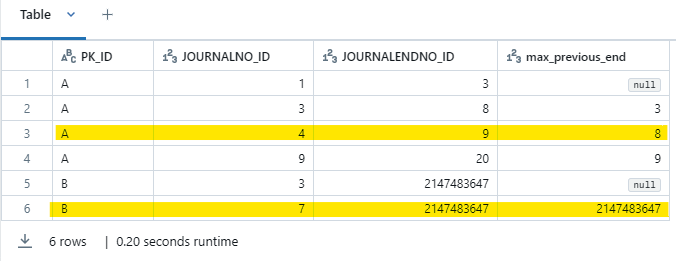
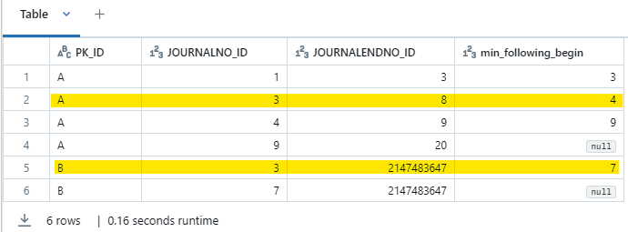
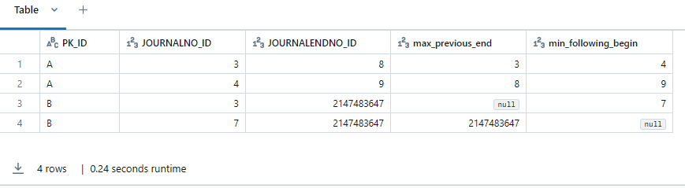

# Overlapping timelines

Let's say we have a source that keeps track of changes, and we ingest the source 
with all the changes. Each change has a validity range. On this page we will
use the columns `JOURNALNO_ID` and `JOURNALENDNO_ID` to define this validity range.
To keep things simple, these columns will be integers. To indicate that a record
is valid, the `JOURNALENDNO_ID` will be set to the integer maximum (2147483647).

The convention that is used is that the number in the `JOURNALENDNO_ID` is not included.
This means that we have the same number in the `JOURNALENDNO_ID` as the `JOURNALNO_ID` 
of the next row, if there is no gap.

Let's consider the following example:

| PK_ID | JOURNALNO_ID | JOURNALENDNO_ID |
|-------|--------------|-----------------|
| A     | 1            | 3               |
| A     | 3            | 8               |
| A     | 4            | 9               |
| A     | 9            | 20              | 
| B     | 3            | 2147483647      |
| B     | 7            | 2147483647      |

In this example, we have 2 overlapping records for the primary key `A` and 2
overlapping records for primary key `B`.

## Logic of the checks

In order to find all the overlapping records, we need to perform 2 window function checks.

### The maximum JOURNALENDNO_ID of the previous rows

The `JOURNALENDNO_ID` of a previous row should ALWAYS be smaller or equal to the `JOURNALNO_ID` of the current row.
If that is not the case then the previous record is still active when the current row is active.

```sql
WITH cte_data AS
(
  SELECT col1 AS PK_ID, col2 AS JOURNALNO_ID, col3 AS JOURNALENDNO_ID
  FROM
      VALUES
          ('A',1,3)
      ,   ('A',3,8)
      ,   ('A',4,9)
      ,   ('A',9,20)
      ,   ('B',3,2147483647)
      ,   ('B',7,2147483647)
)
SELECT *
-- The maximum JOURNALENDNO_ID of te previous rows
, MAX(cte.JOURNALENDNO_ID) OVER (PARTITION BY cte.PK_ID ORDER BY cte.JOURNALNO_ID ROWS BETWEEN UNBOUNDED PRECEDING AND 1 PRECEDING) AS max_previous_end
FROM cte_data as cte
```



As can be seen, only 1 of the overlapping records were found. The next check will find the other one.

### The minimum JOURNALNO_ID of the following rows

The `JOURNALENDNO_ID` of the current row should ALWAYS be smaller or equal to the `JOURNALNO_ID` of the following 
rows. Otherwise, the current row is not properly closed while the next row is starting.

```sql
WITH cte_data AS
(
  SELECT col1 AS PK_ID, col2 AS JOURNALNO_ID, col3 AS JOURNALENDNO_ID
  FROM
      VALUES
          ('A',1,3)
      ,   ('A',3,8)
      ,   ('A',4,9)
      ,   ('A',9,20)
      ,   ('B',3,2147483647)
      ,   ('B',7,2147483647)
)
SELECT *
-- The minimum JOURNALNO_ID of the following rows
, MIN(cte.JOURNALNO_ID) OVER (PARTITION BY cte.PK_ID ORDER BY cte.JOURNALNO_ID ROWS BETWEEN 1 FOLLOWING AND UNBOUNDED FOLLOWING) AS min_following_begin
FROM cte_data as cte
```



## The full check

In this example, we assume that your SQL supports `QUALIFY`. If `QUALIFY` is not supported, you need to create an
additional CTE for filtering.

```sql
WITH cte_data AS
(
  SELECT col1 AS PK_ID, col2 AS JOURNALNO_ID, col3 AS JOURNALENDNO_ID
  FROM
      VALUES
          ('A',1,3)
      ,   ('A',3,8)
      ,   ('A',4,9)
      ,   ('A',9,20)
      ,   ('B',3,2147483647)
      ,   ('B',7,2147483647)
)
SELECT *
-- The maximum JOURNALENDNO_ID of te previous rows
, MAX(cte.JOURNALENDNO_ID) OVER (PARTITION BY cte.PK_ID ORDER BY cte.JOURNALNO_ID ROWS BETWEEN UNBOUNDED PRECEDING AND 1 PRECEDING) AS max_previous_end

-- The minimum JOURNALNO_ID of the following rows
, MIN(cte.JOURNALNO_ID) OVER (PARTITION BY cte.PK_ID ORDER BY cte.JOURNALNO_ID ROWS BETWEEN 1 FOLLOWING AND UNBOUNDED FOLLOWING) AS min_following_begin
FROM cte_data as cte
QUALIFY
-- Overlap when the JOURNALNO_ID of the current row is smaller
   than the maximum JOURNALENDNO_ID of te previous rows
  cte.JOURNALNO_ID < max_previous_end

-- Overlap when the JOURNALENDNO_ID of the current row is larger
   than the minimum JOURNALNO_ID of the following rows
OR cte.JOURNALENDNO_ID > min_following_begin
```


