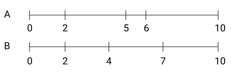
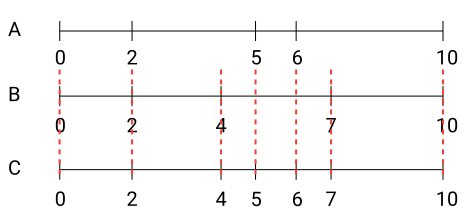

# Merging timelines
Let's say we have the 2 timelines as shown in the picture below. For simplicity sake we 
mark the nodes on the timeline with the numbers 0 to 10. As can be seen, the
ranges do not always coincide. 


In practice this could be 2 satellites in a datavault model connecting to the same hub.
In your datamart you might want to have all attributes put together in chronological
order. 

## Concept
The first step is to create a third timeline that has all the nodes the two other
timelines also have. See picture below.


Then we determine for each interval of the newly created timeline which
parts of the previous 2 timelines should be referenced.

!!! note 
    It is good to note that an interval of the newly generated timeline is always smaller than
    or equal to the interval that was in the original timelines. 

!!! note
    It is also good to remember that since we 
    have created the new nodes from the old nodes, the new node always corresponds to a node
    in one of the original timelines.

By inspecting the picture we can easily come up with the result:

| C-start | C-end | A-start | A-end | B-start | B-end |
|---------|-------|---------|-------|---------|-------|
| 0       | 2     | 0       | 2     | 0       | 2     |
| 2       | 4     | 2       | 5     | 2       | 4     |
| 4       | 5     | 2       | 5     | 4       | 7     |
| 5       | 6     | 5       | 6     | 4       | 7     |
| 6       | 7     | 6       | 10    | 4       | 7     |
| 7       | 10    | 6       | 10    | 7       | 10    |

### Rules
Now we have the results, we can now reverse-engineer the rules to follow for connecting
the correct parts of the original timeline with the new timeline. At first thought you
might get the following 3 rules, when either one of them is true then there should be a match.
In these set of rules we try to match C with B:

* The begin nodes are the same
    * C-start is equal to B-start (0-2), (2-4), (7-10)
* The end nodes are the same
    * C-end is equal to B-end (0-2), (2-4), (7-10)
* The new interval lies completely within the interval of the original
    * C-start (5-6) is larger than B-start and B-end is smaller than A-end 

However, these rules can be simplified by taking into account the notes we have made earlier.
!!! tip
    We do not need to check for the end node!

The reason that we do not need to check for the end node is because the nodes of timeline
C was generated from A and B. This means that it is never going to overshoot
a range from one of the originals. So if the begin point of C is within a range of A,
then by definition the end point of C will also be in the same range of A. 

!!! conclusion
    So the only check we need to perform per interval of C, is that C-start is 
    between A-start and A-end. Depending on how your timelines are setup (whether the end point of 
    the previous record is the same as the start of the next) you might want to 
    exclude or include your between filter.

### Rules for immediately closed records
In case there are records that have the exact same begin and end, and you have 
confirmed that that is functionally correct and desired, you need to have logic for
this special case and for the normal case. For the special case we also need to add
an extra record on timeline C with the C-start and C-end equal.

To the rule for the normal case we need to add that the begin and end are not coinciding.

The rules for the special case would be:

* C-start equals C-end, and
* C-start equals A-start, and
* C-end equals A-end

## Code implementation
For the code sample we will be using SQL. We will also be using Common Table Expressions
to divide up the steps.

### Getting the nodes
```sql linenums="1"
WITH CTE_nodes AS
(
    SELECT DISTINCT id, start_id            FROM A     
    UNION        
    SELECT DISTINCT id, end_id AS start_id  FROM A    
    UNION
    SELECT DISTINCT id, start_id            FROM B     
    UNION        
    SELECT DISTINCT id, end_id AS start_id  FROM B
)
```

### Generating the new timeline
Here we assume that you are using a SQL dialect that supports `QUALIFY` such as snowflake and databricks.
If the SQL dialect does not have this functionality, you would need to add an extra
CTE for filtering.

```sql linenums="1"
,CTE_timelines AS
(
    SELECT 
        id
    ,   start_id
    ,   LEAD(start_id) OVER (PARTITION BY id ORDER BY start_id) AS end_id
    FROM CTE_nodes
    QUALIFY end_id IS NOT NULL
)
```
We do not want the last row, since we put the start and endpoints in the same list.
If you have the special case where the start and end can be the same, we need to manually
append it to the generated timeline.

```sql linenums="1" title="special case"
,CTE_timelines AS
(
    SELECT 
        id
    ,   start_id
    ,   LEAD(start_id) OVER (PARTITION BY id ORDER BY start_id) AS end_id
    FROM CTE_nodes
    QUALIFY end_id IS NOT NULL
    
    UNION
    
    SELECT id, start_id, end_id FROM A WHERE start_id = end_id
    
    UNION
    
    SELECT id, start_id, end_id FROM B WHERE start_id = end_id
)
```

### Attaching original records to the new timeline
```sql linenums="1"
SELECT *
FROM CTE_timelines AS CTE
    LEFT JOIN A
        ON CTE.id = A.id
        AND CTE.start_id >= A.start_id
        AND CTE.start_id < A.end_id
    LEFT JOIN B
        ON CTE.id = B.id
        AND CTE.start_id >= B.start_id
        AND CTE.start_id < B.end_id
```

In case we are dealing with the special case, we have:

```sql linenums="1" title="Special case"
SELECT *
FROM CTE_timelines AS CTE
    LEFT JOIN A
        ON CTE.id = A.id
        AND (
            (CTE.start_id >= A.start_id AND CTE.start_id < A.end_id AND CTE.start_id <> CTE.end_id AND A.start_id <> A.end_id)
            OR
            (CTE.start_id = CTE.end_id AND CTE.start_id = A.start_id AND CTE.end_id = A.end_id)
        )
    LEFT JOIN B
        ON CTE.id = B.id
        AND (
            (CTE.start_id >= B.start_id AND CTE.start_id < B.end_id AND CTE.start_id <> CTE.end_id AND B.start_id <> B.end_id)
            OR
            (CTE.start_id = CTE.end_id AND CTE.start_id = B.start_id AND CTE.end_id = B.end_id)
        )
```

## Full code example
=== "Normal case"
    ```sql linenums="1"
    --8<-- "./docs/Data_Engineering_Analysis/general/timeline_example1.sql"
    ```