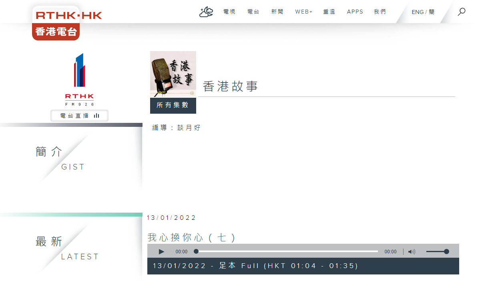
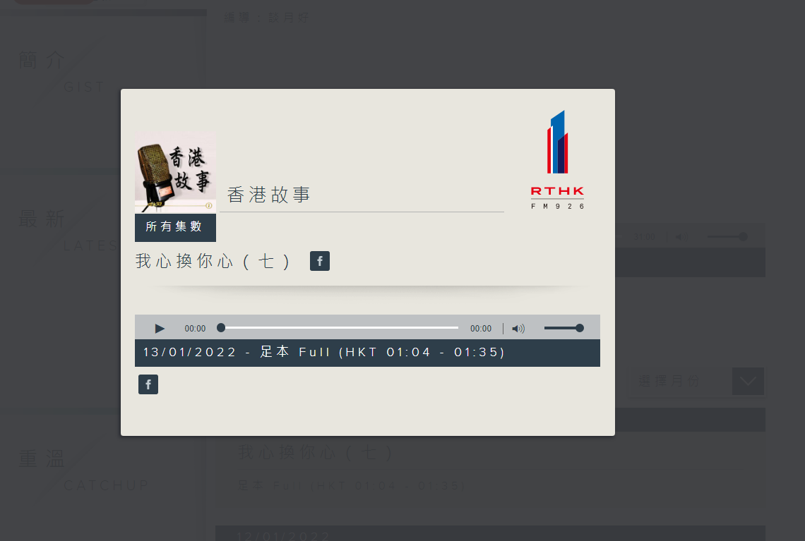
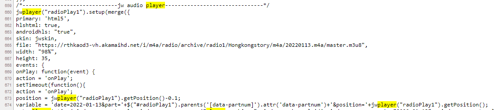

# Record RTHK Archive
For this you will need the tool [FFMPEG](https://www.ffmpeg.org/) and the link to the playlist file.

## Playlist file link
In order to get the playlist link, you need to first navigate to the page of the programme. For example: https://www.rthk.hk/radio/radio1/programme/Hongkongstory.
Once you are on the page, you need to make sure that a player is present (see image below). 



If there is no player available, then you have to click on one of the episodes so a player will appear.



Then what you need to do is Right click and then view page source. The part you need to look for is called
`jw audio player`.

There you will find the file link.

## Record using ffmpeg
Navigate to the folder where the ffmpeg.exe file is. Then open a command window in that folder.

```commandline
ffmpeg -i <file_link> <name_of_downloaded_file>.mp3
```

## Create command file for a specific program
If you want to record a programme more often, it might come in handy to create a bat file for it.

```commandline title="Download for specific date"
@ECHO OFF
SET /p datefile=Date in the format (yyyymmdd)
:Label1
ffmpeg -i https://rthkaod3-vh.akamaihd.net/i/m4a/radio/archive/radio1/Hongkongstory/m4a/%datefile%.m4a/master.m3u8 %datefile%.mp3
for /F %%A in ("%datefile%.mp3") do set size=%%~zA
set /a KB=(%size%/1024)
IF %KB% LSS 16000 (del %datefile%.mp3 & GOTO Label1)
pause
```

```commandline title="Download for today"
@echo off
for /f "tokens=2 delims==" %%a in ('wmic OS Get localdatetime /value') do set "dt=%%a"
set "YY=%dt:~2,2%" & set "YYYY=%dt:~0,4%" & set "MM=%dt:~4,2%" & set "DD=%dt:~6,2%"
set "HH=%dt:~8,2%" & set "Min=%dt:~10,2%" & set "Sec=%dt:~12,2%"

set "datefile=%YYYY%%MM%%DD%" 

:Label1
ffmpeg -i https://rthkaod3-vh.akamaihd.net/i/m4a/radio/archive/radio1/Hongkongstory/m4a/%datefile%.m4a/master.m3u8 %datefile%.mp3
for /F %%A in ("%datefile%.mp3") do set size=%%~zA
set /a KB=(%size%/1024)
IF %KB% LSS 16000 (del %datefile%.mp3 & GOTO Label1)
pause
```

The check for file size was necessary for older versions of ffmpeg and is probably not needed anymore, as the tool
has become a lot more stable.