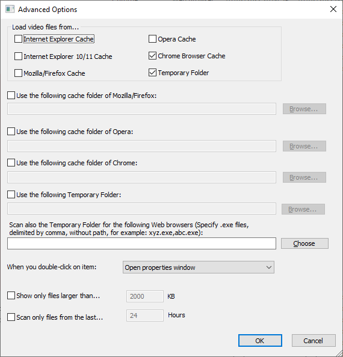
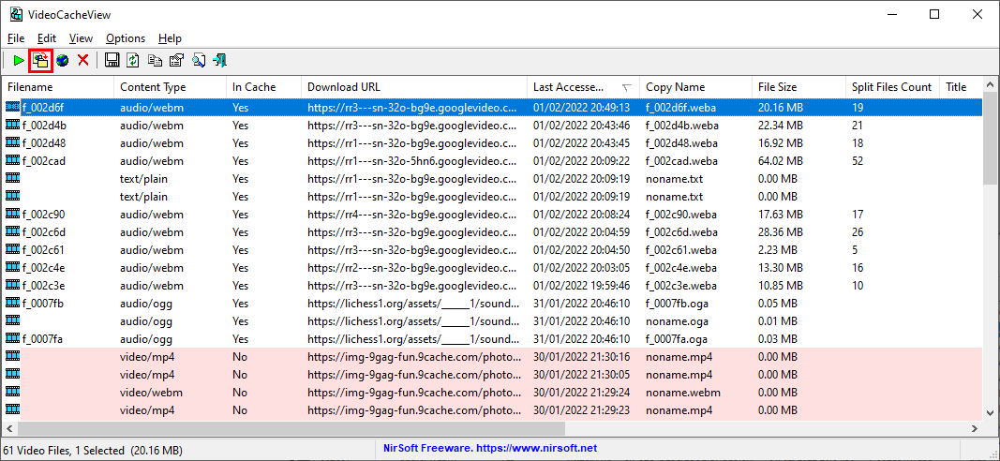
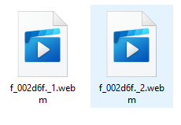

# Download online videos
## youtube-dl
!!! attention
    2022-Feb: There seems to be something wrong with youtube-dl as the download speeds are way down.

The easiest way to download a video from one of the popular sites such as Youtube and Vimeo is to use
[youtube-dl](https://youtube-dl.org/) (link to [github](https://github.com/ytdl-org/youtube-dl)). 
Although the name suggests that it can only download from Youtube, the contrary is true. For the full list
please visit: https://ytdl-org.github.io/youtube-dl/supportedsites.html.

### Download and installing
There are multiple ways to install youtube-dl. You can download the compiled binary (.exe) or you can
use pip to install it, as it is written in python. Downloading the exe file does not require installing.

### Basic syntax
The most simple syntax is by just passing the URL to the program.

```commandline
youtube-dl <your-URL>
```

### Pair with ffmpeg
If you want to have some format conversion options, you can pair youtube-dl with ffmpeg. You just
need to make sure that either the binaries are in the same folder, or that both are registered in
the environment variables.

Then you can for example do the following to extract the audio as mp3.

```commandline
@ECHO OFF
SET /p Link=YoutubeLink (Rechtermuisknop): 
bin\youtube-dl.exe -f bestaudio --audio-quality 0 --prefer-ffmpeg --extract-audio --audio-format mp3 %Link%
```

## VideoCacheView
If youtube-dl does not work you can always try to retrieve the video from the browser cache. If you
can view something, you should be able to download it. To retrieve videos (and also other media) from cache
you can use [VideoCacheView](https://www.nirsoft.net/utils/video_cache_view.html).

### How to use
When first opening the application it should show you some options you can set. If the dialog does not 
show up, you can go to the menu bar -> Options -> Advanced Options. In there, make sure that your
browser is ticked.



Then navigate in your browser to the video and let it buffer.

!!! tip
    You can speed up the process by manually skipping to the end of what has been buffered.

While buffering you can keep an eye on the VideoCacheView window. The file names are a bit cryptic,
but if you sort on last accessed or file size you should be able to easily determine which file is yours.
Also because the size is increasing as it buffers, that is also an easy hint to the correct file.



Select the file you want and then press the second button from the left to copy the files. In the
next dialogue you can choose the destination. You will see 2 files, 1 containing the audio stream and
the other containing the video stream. The outputs can either be `.mp4` format or `.webm`. 



!!! note
    When the format is `.mp4` VideoCacheView will attempt to merge them using a library called
    [GPAC](https://github.com/gpac/gpac). If you do not have that library installed you will get 
    the 2 separate files.

### Combining video and audio
To combine the video and audio, you can make use of [ffmpeg](https://www.ffmpeg.org/). See the
following post on superuser for the source: https://superuser.com/questions/277642/how-to-merge-audio-and-video-file-in-ffmpeg.

```commandline
ffmpeg -i video.mp4 -i audio.wav -c:v copy -c:a aac output.mp4
```

In this example the video is not re-encoded but the audio is. In case re-encoding is not 
necessary at all you can use:

```commandline
ffmpeg -i video.mp4 -i audio.wav -c copy output.mkv
```