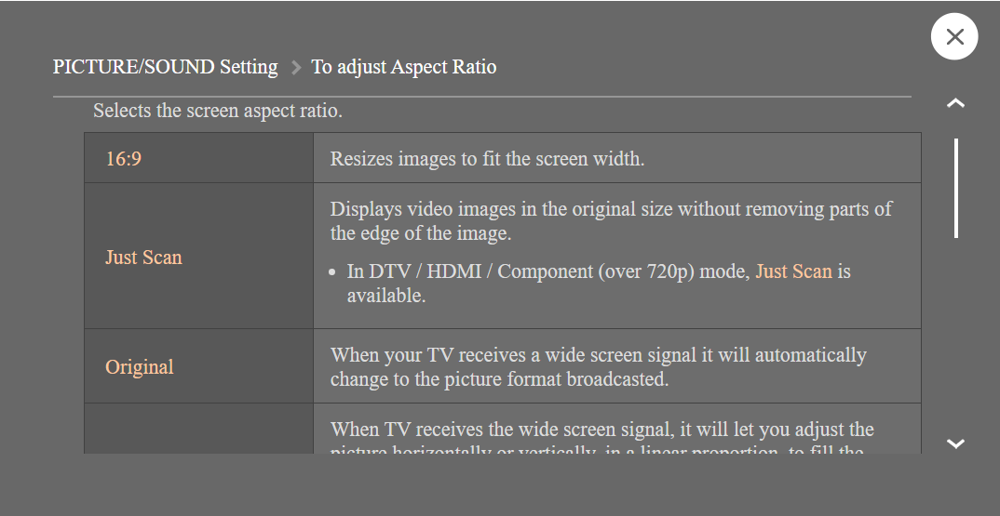

# Overscan on TV's
Sometimes you see that a part of your screen is missing if you plug in your PC. This phenomenon is called
overscan. This was used in older CRT TV's to make the most important part of the view fit. 

On fixed pixel devices such as modern TV's this is not needed anymore. For more information see this article
on [howtogeek](https://www.howtogeek.com/252193/hdtv-overscan-what-it-is-and-why-you-should-probably-turn-it-off/).

You can resolve this by setting the picture settings on your TV. https://leapfrog.happyfox.com/kb/article/267-2993/

For LG you have to look for `Just Scan` in the aspect ratio menu.
