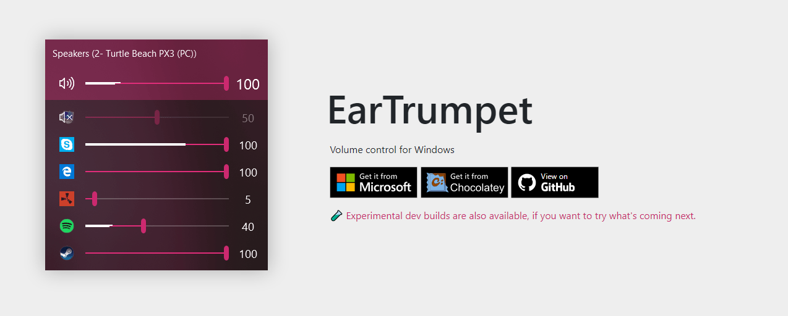

# Custom Volume Mixer
The standard volume mixer in Windows 10 and 11 is not always practical. You need to click through some menus
to get to the per application volume (the volume mixer). Also it is not easy to assign one speaker to a 
specific application.

With [EarTrumpet](https://eartrumpet.app/) this should be possible.
