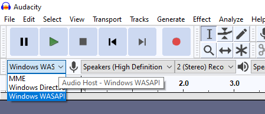

# Record System Audio
The simplest way to record the system audio is by using the program [Audacity](https://www.audacityteam.org/).
In the top left corner you need to select `WASAPI` as the input. Then all you need to do is press the record button.

