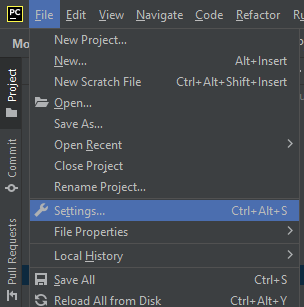
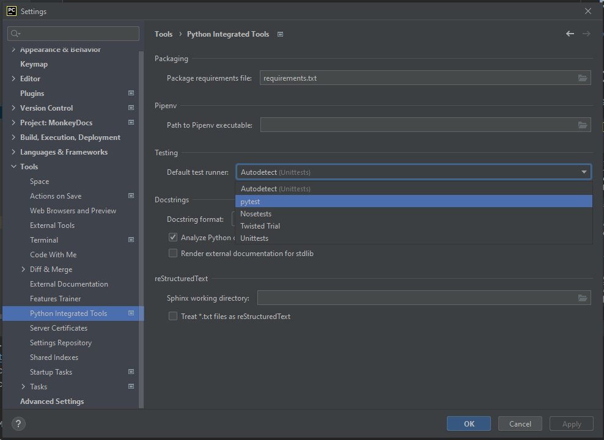

# Pycharm
[Pycharm](https://www.jetbrains.com/pycharm/) is created by Jetbrains, which also developed Intellij.

## Configure default test runner
Go to `File` then `Settings`.

Then in the new window navigate to `Tools` -> `Python Integrated Tools`

From the dropdown select the test runner of your choosing.