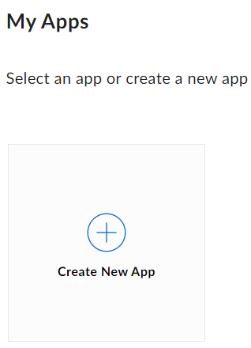
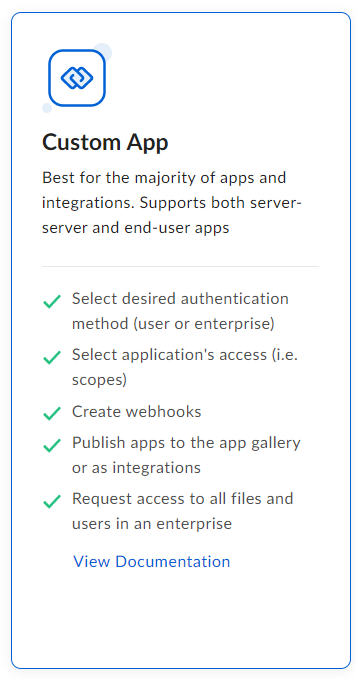
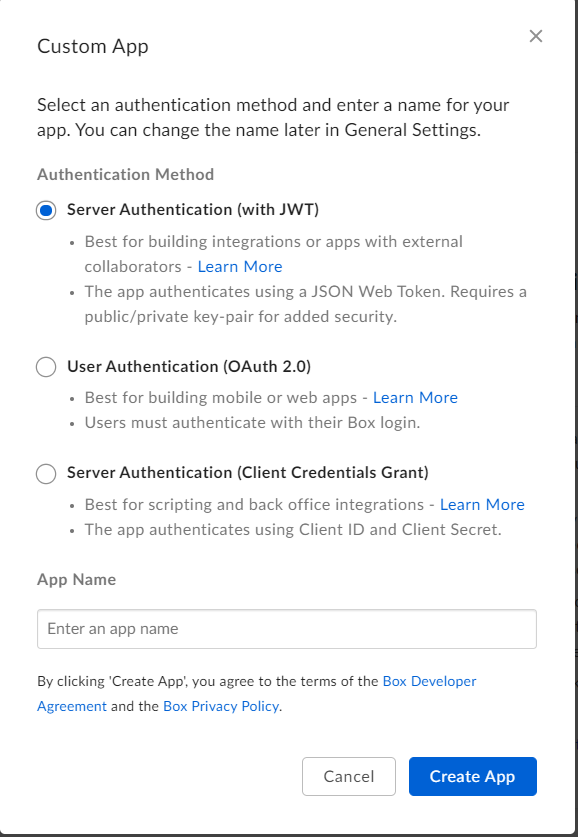
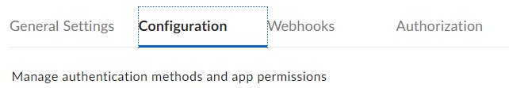
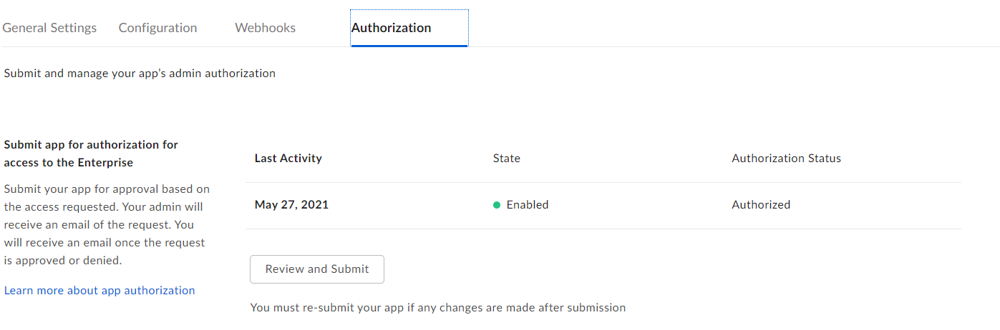
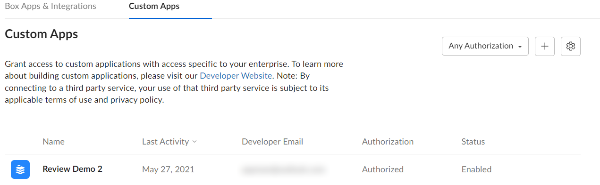
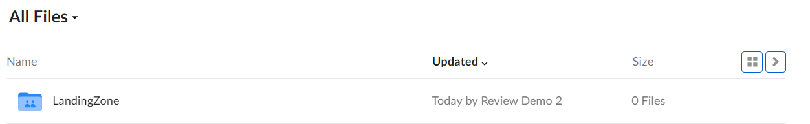
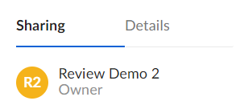

# BoxSDK

## Setting up a Box app
1. Go to https://app.box.com/developers/console and create a new app.

    

2. Choose custom app:

    

3. Go for the option with JWT and choose your app name.

    

4. Once in your app, navigate to the configurations tab.

    

5. The only permissions we need for a simple landing zone app are the read all files and folders and write all files and folders.

    

6. Now scroll down and generate a public/private key pair. The configuration file will be automatically downloaded. **Please do not lose the file, otherwise you will need to generate a new key pair!**

    

7. The config file will look like:

    ```
        Configuration file
        {
          "boxAppSettings": {
            "clientID": "68zmu8tw4xaax0f4y1mjz5qqukx5v0u3",
            "clientSecret": "********************************",
            "appAuth": {
              "publicKeyID": "",
              "privateKey": "",
              "passphrase": ""
            }
          },
          "enterpriseID": "737833"
        }
    ```
   
8. In order to authenticate through this config file, we need to get the app authorized by the Box Admins. 
For this Navigate to Authorization and press submit. In that development environment you are admin yourself 
so you can approve yourself.

    
   The Box admins will see your app pop up in their list with apps, and they can then authorize it.

    

9. In order to access the app programmatically we will use python and the boxsdk for python.

    ``` cmd
      pip install boxsdk[jwt]
    ```

10. Making connection to Box.

    ``` py
    from boxsdk import JWTAuth
    from boxsdk import Client
    from boxsdk.object.collaboration import CollaborationRole
     
    config_file_path = './819136809_sh9k5jf3_config.json'
    auth = JWTAuth.from_settings_file(config_file_path)
    client = Client(auth)
     
    # Print the user info, just a check to confirm the connection.
    print(client.user().get())
    ```

11. Now we are logged in as the service user. You won't be seeing any files from your own box. To check that we can request all items in the root folder:
    ```  py
    # Folder_id 0 is standard for the root folder. As it is generic, we cannot grant permissions on this folder.
    folder_contents = client.folder(folder_id='0').get_items()
     
    for item in folder_contents:
        print(item)
    ```

12. The final step is to create a subfolder in the root folder of the service user and make ourselves co-owner. We should create a subfolder for each solution we are working on.
    
    ``` py
    # Folder_id 0 is standard for the root folder. As it is generic, we cannot grant permissions on this folder.
    root_folder = client.folder(folder_id='0')
    
    collab_folder = root_folder.create_subfolder('LandingZone')
    collaborator_email = '<Put your own email here>'
    collab_folder.add_collaborator(collaborator_email, CollaborationRole.CO_OWNER)
    ```

13. With the permission given to ourselves, we should be able to see this folder in our own root directory.

    
  And when we click on the folder and look at the details pane on the right, we will see that the app is listed as the owner of the folder:

    
