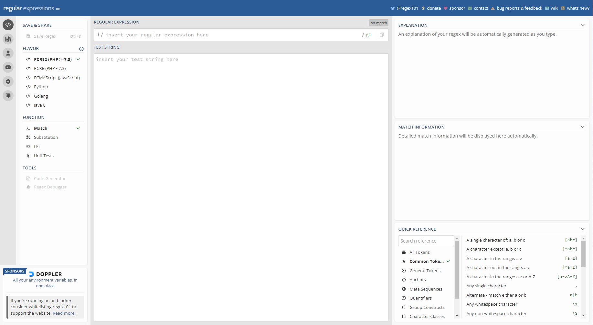
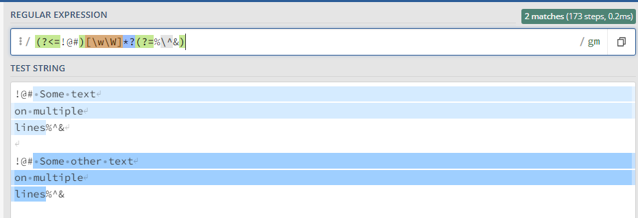
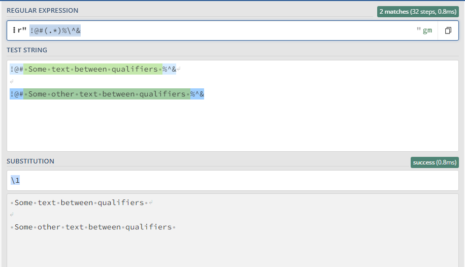

# Regular Expressions

Regular expressions (or in short Regex) are used to match a certain pattern in a text. It is also possible to
substitute parts of a string. A great resource to learn and experiment with regex is [regex101](https://regex101.com/).



Regex101 provides among many things an interactive editor to try out your regular expressions. It also highlights parts
of your regex and provides explanations on each of the parts.

## Pattern matching
In this section we will go over some patterns that might be useful.

### Extract string between some qualifiers
Let's say we have a weird structure of symbols enclosing a string. Starting with `!@#` and ending with `%^&`.

```text
!@# Some text between qualifiers %^&

!@# Some other text between qualifiers %^&
```
Then we can simply do the following:
```regexp
(?<=!@#).*(?=%\^&)
```

`(?<=!@#)` means that there is something in front of the string you want to look for that contains those 3 symbols.
`(?=%\^&)` means that there is something after the string that has the other 3 symbols. These are called 
positive lookbehind and positive lookahead. Positive, because it indicates it should match the provided pattern. 
The lookbehind and lookahead are not part of the match. 

The center part `.*` means that it should match any character except for line terminators. So for this example it works fine.

But what if we have the following example.

```text
!@# Some text
on multiple
lines%^&

!@# Some other text
on multiple
lines%^&
```

For this to work we need to modify the center part to match absolutely everything.

```regexp
(?<=!@#)[\w\W]*(?=%\^&)
```
We have replaced the dot with `[\w\W]`. The brackets mean a single character, `\w` means all word characters and `\W` means
everything BUT a word character. By using this trick you are basically saying that you want to match everything. This 
however does not work as intended yet. The matched text is:

```text
 Some text
on multiple
lines%^&

!@# Some other text
on multiple
lines
```

This is because the `*` is greedy. This means that it does not stop at the first `$%^`, but goes on until it hits the last.
In order to make it lazy, we just need to put a `?` after the `*`.

```regexp
(?<=!@#)[\w\W]*?(?=%\^&)
```



## Substitution
With substitution you can replace what you have matched. 

### Example by using groups
Let's use the same example as for the qualifiers.

```text
!@# Some text between qualifiers %^&

!@# Some other text between qualifiers %^&
```

Say we want to remove the qualifiers but keep what is inside. We can then add brackets around the center part of the 
regex to create a group. This group will get assigned an id, which we will use in the substitution. We also need to drop
the lookbehind and lookahead, because they don't show up in the match, and thus will not be touched by the substitution.

```regexp
!@#(.*)%\^&
```

Then in the substitution pattern we can refer to this group by `\1`. In this case it is 1 because it is the first group in the regex.
Because the group is all we want we the substitution pattern is just

```regexp
\1
```


=== "Python"
    ```Python
    import re
    string_to_sub = "!@# Some text between qualifiers %^&" 
    subbed_string = re.sub(r"!@#(.*)%\^&",r"\1", string_to_sub) 
    ```